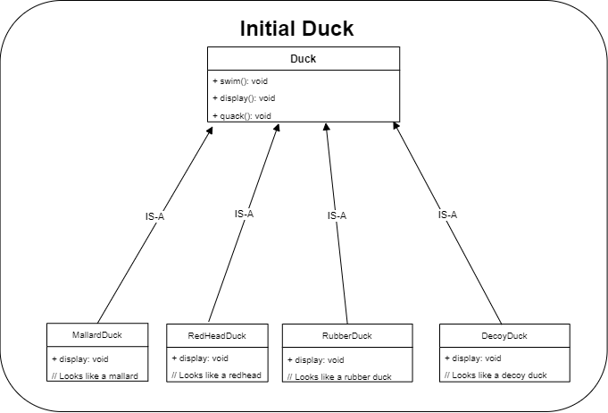
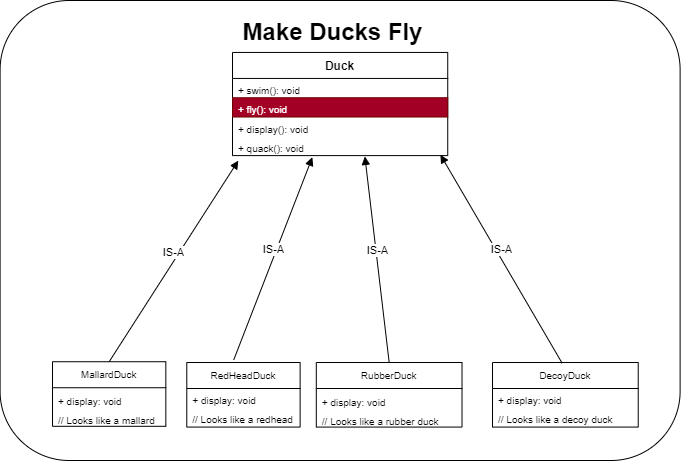
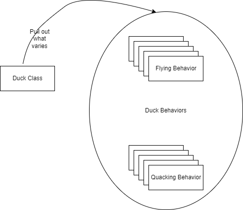
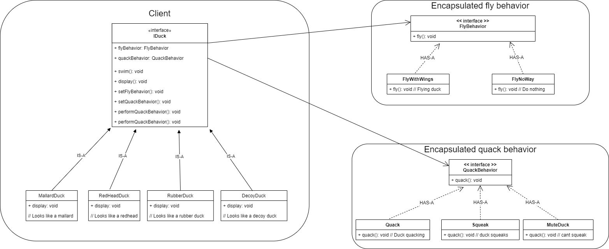

[Main](../../README.md)
# Head First Design Patterns

## Design Principals
* Identify parts of the application that vary and separate them from what stays the same.
* Program to an interface not an implementation.
* Composition over inheritance.

## ULM for Duck mini simulator

This is the first look at using interfaces to make the code more flexible to changes.
Any methods or attributes that could vary from subclass to subclass was separated out from the attributes that stay the same.

* Quack
* Fly

Both of these attributes could be different depending on the type of duck subclass being created.  Rubber ducks cannot normally fly unless you strap a rocket to their backs.

The initial layout for the worked fine.  All the different ducks behaved as they should. All the duck overriding the display method to print out the correct text for each duck.


*Display method overrides*

Then they decide that they want to add the feature to fly.  Easy just add fly to the parent class and then all the ducks can fly.  The ones that don't fly will have to override the method.  This would mean that we would then have to visit each subclass and override any new methods that we add.  Not very practical as the application grows.


*Now all the ducks can fly*
Design Principals
```
    Design Principals
    Identify parts of the application that vary and separate them from what stays the same.
```
Looking a the SuperClass we can see that quack and fly may well change for each subClass that inherits it.  So we separate them out and encapsulate them into behaviors. 
* Quacking
* Flying





*Final solution making the application more flexible and easier to maintain.*